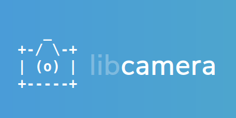

.. post:: 08 November 2019
   :category: conference
   :author: Kieran
   :language: en
   :image: 1

ELCE 2019 recording now available
---------------------------------

Jacopo's talk "A call for Public API Review" is now available on `youtube`_.

libcamera has just turned one year old and keeps advancing in its purpose to
provide a complete userspace camera stack for Linux-based systems.

Since its conception and initial developments, libcamera has progressed to
support an increasing number of platforms and devices, and has expanded its
feature to provide integration in other Linux-kernel-based operating systems
(such as Android and ChromeOS). It now allows integration of 3A algorithms
while still providing an easy to grasp API for camera applications.

As libcamera is reaching feature stability, it has entered the API review and
stabilisation phase and needs feedback from application developers and camera
vendors. This talk is part of our call for review, starting with a presentation
of the libcamera features, architecture and API (based on practical examples),
and then moving to a discussion with the audience to gather feedback.

.. _youtube: https://youtu.be/FovurKj28rw
