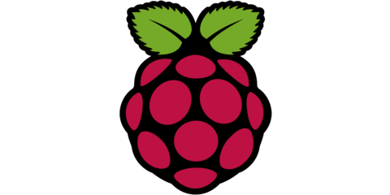

.. post:: 05 May 2020
   :category: platforms
   :author: Kieran
   :language: en
   :image: 1

---------------------------------------------------------
libcamera powers Raspberry Pi’s Open Source Camera System
---------------------------------------------------------

Traditionally, configuring a camera device on an embedded Linux system has
involved a twisty maze of libraries, frameworks, and proprietary vendor blobs.
Now, the libcamera project has supported Raspberry Pi (Trading) Ltd. with its
release of the Raspberry Pi Open Source Camera System, using libcamera to offer
the first product-quality fully open camera stack.

A new API
---------

libcamera is a relatively new project working to create an open-source camera
stack for many platforms with a core userspace library, and support from the
Linux kernel APIs and drivers already in place. It aims to control the
complexity of embedded camera hardware by providing an intuitive API and a
method of separating untrusted vendor code from the open source core. Why the
new API? The Image Signal Processors (ISPs) found in most SoCs are very
different from one another, and modern embedded cameras, such as those found in
smartphones and IoT devices, are far more complex than when the V4L2 subsystem
was first created.

Handling that complexity, and the lack of an open framework for the userspace
side, has led vendors to develop their own closed-source and platform specific
layers, frequently duplicating efforts, solving issues in incompatible ways,
and leaving free software without support. libcamera makes accessing those
devices much easier. It works with Android, Chrome OS, and GNU Linux, and comes
with compatibility layers for the other major video/camera APIs including the
Android camera framework, gstreamer and V4L2. As part of the new Open Camera
System, Raspberry Pi has updated the V4L2 drivers for its v1 (OmniVision
OV5647) and v2 (Sony IMX219) camera modules, developed a new HQ camera (Sony
IMX477), and is working on upstreaming the Broadcom Unicam CSI-2 and ISP
peripheral drivers to support libcamera.

Algorithm Plugins
-----------------

A major hurdle on the road to open-source camera stacks is that the algorithms
responsible for image processing are still considered to be ‘secret sauce’ by
camera IP vendors -- with the result being that none of them have open-sourced
their code. For the Open Source Camera System, Raspberry Pi (Trading) Ltd has
developed its own Image Processing Algorithms (IPA) and contributed them to
libcamera under a BSD-2-Clause license. For the first time, users can now take
advantage of completely open-source Auto Exposure Control (AEC), Auto Gain
Control (AGC), Auto White Balance (AWB), and Lens Shading Correction (LSC)
algorithms, along with controls for noise, sharpness, and contrast.

To support platforms that only provide closed-source algorithms, libcamera uses
a plugin system for IPA modules. Open-source modules are identified based on
digital signatures, while closed-source modules are isolated inside a Sandbox
environment with restricted access to the system. The Sandbox feature provides
a middle ground approach whereby vendors can keep their private algorithms
private and open-source platforms can reduce the impact of untrusted blobs.

Open Cameras
------------

Like closed-source, high-end camera libraries, libcamera can set controls on a
per-frame basis, which makes it possible to have finer-grained control over
image quality processing to support use cases in fields such as industrial
vision or autonomous driving. With their new algorithms and driver updates, the
Raspberry Pi Open Source Camera System allows users to add their own sensors to
the Raspberry Pi and allows building a fully-functional camera stack with
open-source components. This opens up a whole new world of possibilities for
everyone from individual hobbyists to small corporations that don’t have access
to the proprietary vendor code.

Interested developers can now make use of libcamera to research and develop
their own algorithms on readily available platforms like the Raspberry Pi,
Rockchip RK3399 and selected Intel (IPU3) devices without needing to implement
a full stack of their own.
